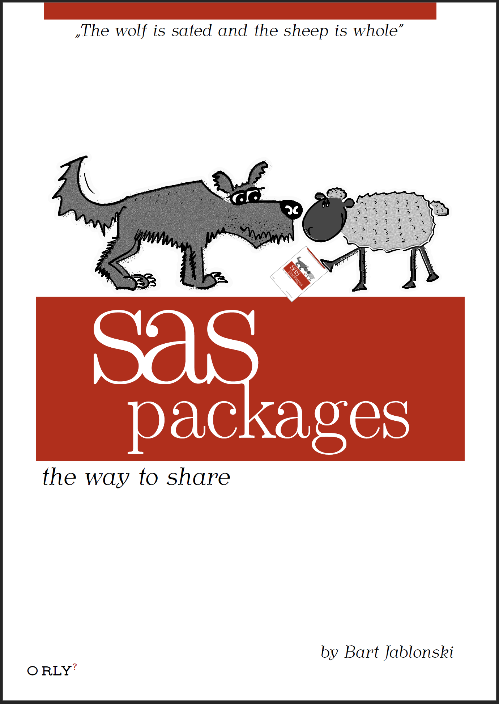

```


                         Materials for Workshops

          _____ _                                                    
         / ____| |                                                   
        ( (___ | |__   __ _ _ __ ___   _   _  ___  _   _ _ __        
         \___ \| '_ \ / _` | '__/ _ \ | | | |/ _ \| | | | '__)       
         ____) | | | | (_| | | |  __/ | |_| | (_) | |_| | |          
        |_____/|_| |_|\__,_|_|  \___)  \__, |\___/ \__,_|_|          
                                        __/ |                        
                           _           (___/ _ _   _                 
                          | |               (_) | | |                
              ___ ___   __| | ___  __      ___| |_| |__              
             / __/ _ \ / _` |/ _ \ \ \ /\ / / | __| '_ \             
            ( (_( (_) ( (_| |  __/  \ V  V /| | |_| | | |            
             \___\___/ \__,_|\___)   \_/\_/ |_|\__|_| |_|            
                                                                     
   _____          _____   _____           _                          
  / ____|  /\    / ____| |  __ \         | |                         
 ( (___   /  \  ( (___   | |__) )_ _  ___| | ____ _  __ _  ___  ___  
  \___ \ / /\ \  \___ \  |  ___/ _` |/ __| |/ / _` |/ _` |/ _ \/ __) 
  ____) / ____ \ ____) | | |  | (_| | (__|   < (_| | (_| |  __/\__ \ 
 |_____/_/    \_\_____/  |_|   \__,_|\___|_|\_\__,_|\__, |\___||___/ 
                                                     __/ |           
                                                    |___/            
                           Bartosz Jabłoński


```

---

------

---------

------------

---------------

------------------

---------------------

#### Materials for:

# `   Share your code with SAS Packages   ` <br/> `   a Hands-on-Workshop   ` 

### by [Bartosz Jabłoński](https://www.linkedin.com/in/yabwon)



---

---


## Table of Contents

- [Abstract](#abstract)
- [Technical requirements](#technical-requirements)
- [Introduction](#introduction)
- [Links](#links)
- [Start With a Directory](#start-with-a-directory) 
- [How to Install the SAS Packages Framework?](#how-to-install-the-sas-packages-framework)
- [How to Use the SAS Packages Framework?](#how-to-use-the-sas-packages-framework)
- [How to Install a SAS Package?](#how-to-install-a-sas-package)
- [How to Use SAS Packages?](#how-to-use-sas-packages)
- [A Few Lines of Summary](#a-few-lines-of-summary)
- [Play a Live Demo With a SAS Package](#play-a-live-demo-with-a-sas-package)
- [How to Develop a SAS Package?](#how-to-develop-a-sas-package)
- ["Few other details"](#few-other-details)
- [Why SAS Packages and the Framework?](#why-sas-packages-and-the-framework)
- [Thanks](#thanks)
- [Q&As](#qas)
  
---

```


```

## Abstract

When working with SAS code, especially when it becomes more and more complex, there is a point in time when a developer decides to break it into small pieces. The developer creates separate files for macros, formats/informats, and for functions or data too. 
Eventually the code is ready and tested and sooner or later you will want to share code with another SAS programmer.

Maybe a friend has written a bunch of cool macros that will help you get your work done faster.
Or maybe you have written a pack of functions that would be useful to your friend. 

There is a chance you have developed a program using local PC SAS, and you want to deploy it to a server, 
perhaps with a different OS. If your code is complex (with dependencies such as multiple macros, formats, datasets, etc.), it can be difficult to share. Often when you try to share code, the receiver will quickly encounter an error because of a missing helper macro, missing format, or whatever...
 
Small challenge, isn't it? 

How nice it would be to have it all (i.e. the code and its structure) wrapped up in a single file - a *SAS package* - which could be copied and deployed, independent from OS, with a one-liner like: `%loadPackage(MyPackage)`. 

In the presentation an idea of how to create such a *SAS package* in a fast and convenient way, using the *SAS Packages Framework*, will be shared. 

We will discuss: 
 1) concept of how to build a package, 
 2) the tools required to do so (the framework), 
 3) overview of the process, and 
 4) how to build a package (with examples). 

The intended audience for the presentation is intermediate or advanced SAS developers (i.e. with good knowledge of Base SAS and practice in macro programming) who want to learn how to share their code with others.


<div align="right">
  <a href='#table-of-contents'>go to ToC</a>
</div>

---

## Technical Requirements

The workshop assumes that you have available the following resources:
- a computer with internet access,
- a SAS session (may be local or remote), the interface can be: `SAS DMS`, `SAS EG`, or `SAS Studio`, can be `SAS 9.4` or `Viya` with `SPRE`
- the SAS session has:
  - direct internet access or
  - you are able to upload files to the computer hosting your session,
  - (nice to have but not required) the SAS session has `XCMD` option enabled.

Additionally, we assume that *you* wrote at least a few of those: a macro, a function (fcmp, proto, or casl), a format or informat, or an IML module. The more the better.

<div align="right">
  <a href='#table-of-contents'>go to ToC</a>
</div>

---

## Introduction

### Packages

In the world of programmers, software developers, or data analysts the concept of a package, as a practical and natural medium to share your code with other users, is well known and common. Consider a few examples of popular languages that use packages: `Python`, `TeX` , and `R`. There are, literally, thousands of packages available for each language, shared at archives such as:

- `https://pypi.org/`
- `https://www.ctan.org/`
- `https://cran.r-project.org/`

The fundamental question of a new or a seasoned SAS User should be: **"Why isn't there anything like packages in SAS?"**

The *SAS Packages Framework*, introduced in [[Jablonski 2020]](https://github.com/yabwon/SAS_PACKAGES/blob/main/SPF/Documentation/SAS(r)%20packages%20-%20the%20way%20to%20share%20(a%20how%20to)-%20Paper%204725-2020%20-%20extended.pdf "SAS Packages - the Way to Share"), tries to fill that gap.

*Note*: The idea presented here should not be confused with other occurrences of a "package" concept which could be found in the SAS ecosystem, e.g. `proc DS2` packages, `SAS/IML` packages, `SAS ODS` packages, SAS Integration Technologies Publishing Framework packages, or even Enterprise Guide `*.egp` files.

The closest one to the idea presented here is the `SAS/IML` which offers (limited to `IML` only) functionality similar to the concept of a package in `R` language, but in general, such functionality is not available in the Base SAS. 


### Definitions

A **SAS package** is an automatically generated, single, stand alone `zip` file containing organized and ordered code structures, created by the developer and extended with additional automatically generated "driving" files (i.e. description, metadata, load, unload, and help files). 
The purpose of a package is to be a simple, and easy to access, code sharing medium, which allows: on the one hand, to separate the code complex dependencies created by the developer from the user experience with the final product and, on the other hand, reduce developer's and user's unnecessary frustration related to the deployment (installation) process.

The **SAS Packages Framework** is a "pack" of macros, which allows the *use* and *development* of SAS packages. At the moment there are 12 (twelve) macros in the framework.

Ten of them dedicated for users:

- [`%listPackages()         `](https://github.com/yabwon/SAS_PACKAGES/blob/main/SPF/SPFinit.md#listpackages         )

- [`%installPackage()       `](https://github.com/yabwon/SAS_PACKAGES/blob/main/SPF/SPFinit.md#installpackage       )

- [`%verifyPackage()        `](https://github.com/yabwon/SAS_PACKAGES/blob/main/SPF/SPFinit.md#verifypackage        )
- [`%helpPackage()          `](https://github.com/yabwon/SAS_PACKAGES/blob/main/SPF/SPFinit.md#helppackage          )
- [`%previewPackage()       `](https://github.com/yabwon/SAS_PACKAGES/blob/main/SPF/SPFinit.md#previewpackage       )

- [`%loadPackage()          `](https://github.com/yabwon/SAS_PACKAGES/blob/main/SPF/SPFinit.md#loadpackage          )
- [`%loadPackageS()         `](https://github.com/yabwon/SAS_PACKAGES/blob/main/SPF/SPFinit.md#loadpackages         )

- [`%loadPackageAddcnt()    `](https://github.com/yabwon/SAS_PACKAGES/blob/main/SPF/SPFinit.md#loadpackageaddcnt    )

- [`%unloadPackage()        `](https://github.com/yabwon/SAS_PACKAGES/blob/main/SPF/SPFinit.md#unloadpackage        )

- [`%extendPackagesFileref()`](https://github.com/yabwon/SAS_PACKAGES/blob/main/SPF/SPFinit.md#extendpackagesfileref)

and two dedicated to developers:

- [`%generatePackage()      `](https://github.com/yabwon/SAS_PACKAGES/blob/main/SPF/SPFinit.md#generatepackage      )

- [`%splitCodeForPackage()  `](https://github.com/yabwon/SAS_PACKAGES/blob/main/SPF/SPFinit.md#splitcodeforpackage  )

The above list contains links to the documentation of each macro, similar documentation in a text form can be displayed in the SAS log by running the following code:

```sas
%nameOfTheMacro(HELP)
```

For example:

```sas
%listPackages(HELP)

%installPackage(HELP)

%generatePackage(HELP) 
```

### Basic steps

To create a package the developer executes a few simple steps which, in general, are:
- prepare the code (package content files) and a description file,
- "fit" code and description file into a structured form (see next sections for details), 
- download the `SPFinit.sas` (the SAS Packages Framework) file,
- and execute the `%generatePackage()` macro.

To use a package the user executes even simpler steps which, in general, are:
- download the `SPFinit.sas` (the SAS Packages Framework) file,
- execute the `%installPackage(packageName)` and the `%loadPackage(packageName)` macros.

The framework is open-source MIT licensed project available at GitHub (see [Links](#links))

The article [[Jablonski 2021]](https://github.com/yabwon/SAS_PACKAGES/blob/main/SPF/Documentation/Paper_1079-2021/My%20First%20SAS%20Package%20-%20a%20How%20To.pdf "My First SAS Package - a How To") provides a step-by-step tutorial illustrating the process for developing a SAS package.

[*Note.*]
Though using or generating a package is a very straightforward process, the creation of package content (i.e. macros, functions, formats, etc.) requires some experience. 
That is why the intended readers for the following text are *at least* intermediate SAS programmers. 
Good knowledge of Base SAS and practice in macro programming will be an advantage. 
Such a background knowledge can be found for example in "Carpenter's Guide to Innovative SAS Techniques" ([see excerpt](https://support.sas.com/content/dam/SAS/support/en/books/carpenters-guide-to-innovate-sas-techniques/62454_excerpt.pdf) to get a general overview).


<div align="right">
  <a href='#table-of-contents'>go to ToC</a>
</div>

---

## Links

#### Useful links

In this section you will find a list of useful links. During the workshop you can come back here whenever you need to find an address pointing to the subject being discussed.

- Repository for the [**SAS Packages Framework (SPF)**](https://github.com/yabwon/SAS_PACKAGES "SAS Packages Framework")
- Location of the [**SAS Packages Repository**](https://github.com/SASPAC "SAS Packages Repository") (SASPAC)
- List of [**available packages**](https://github.com/orgs/SASPAC/repositories "Available packages") in SAS Packages Repository (SASPAC)

- The SPF [**code file**](https://github.com/yabwon/SAS_PACKAGES/blob/main/SPF/SPFinit.sas "SPF code file")
- The SPF [**documentation file**](https://github.com/yabwon/SAS_PACKAGES/blob/main/SPF/SPFinit.md "SPF documentation file")
- The SPF [**documentation directory**](https://github.com/yabwon/SAS_PACKAGES/tree/main/SPF/Documentation "SPF documentation directory")

- Backup mirror of the [SAS Packages Framework](https://pages.mini.pw.edu.pl/~jablonskib/SASpublic/SAS_PACKAGES "mirror of the SAS Packages Framework")


Articles:
- [["SAS Packages - the Way to Share", B. Jablonski, 2020]](https://github.com/yabwon/SAS_PACKAGES/blob/main/SPF/Documentation/SAS(r)%20packages%20-%20the%20way%20to%20share%20(a%20how%20to)-%20Paper%204725-2020%20-%20extended.pdf "SAS Packages - the Way to Share")
- [["My First SAS Package - a How To", B. Jablonski, 2021]](https://github.com/yabwon/SAS_PACKAGES/blob/main/SPF/Documentation/Paper_1079-2021/My%20First%20SAS%20Package%20-%20a%20How%20To.pdf "My First SAS Package - a How To")


Presentation:
- ["Getting Started with SAS Packages"](https://github.com/yabwon/SAS_PACKAGES/blob/main/SPF/Documentation/Getting_Started_with_SAS_Packages.pdf "Getting Started with SAS Packages")
 

<div align="right">
  <a href='#table-of-contents'>go to ToC</a>
</div>

---

## Start With a Directory

To work with SAS Packages and the SAS Packages Framework (SPF) we need to create a directory where the framework and packages will be located.

Create a directory of your convenience, for example:

- `C:\users\myuser\Desktop\Packages`
- `D:\SAS_Packages`
- `/home/myuser/myPackages`
  
or maybe, if you are doing it as a "global" server setup, like this:

- `/sas/public/packages`

In that directory the SPF and packages (made by you or downloaded) will be stored. 

**[Note:]** We call the directory a "*packages directory*" and in all future examples we use value of: `/path/to/my/packages` . Remember to substitute the value accordingly to your setup!

The framework is design in such a way that the packages directory **has to be** referred by fileref `packages`. In your SAS session, preferably at the beginning, you will have to run the following line of code:

```sas
filename packages "/path/to/my/packages";
```

To verify the assignment went well run the following line:

```sas
filename packages list;
```

The SAS log should produce a printout similar to this:

```
1    filename packages list;
NOTE: Fileref= PACKAGES
      Physical Name= /path/to/my/packages

```

*[Warning:]* The SPF reserves the `packages` reference so if you overwrite it during your work don't be surprise that the Framework may stop working as it should.

*[Note:]* The SPF is designed in such a way that the `packages` reference can point to multiple directories (like libraries do) but in this HoW we will assume there is only one directory. Discussion about the multi-directory case can be found in the ["Few other details"](#few-other-details) chapter.

<div align="right">
  <a href='#table-of-contents'>go to ToC</a>
</div>

---

## How to Install the SAS Packages Framework?

The SPF installation process, in a "nutshell", reduces to copying the `SPFinit.sas` file into the packages directory. It can be done automatically or manually.

You may ask: *is it safe to install?* 

Yes, it's safe! When you install the SAS Packages Framework, and later when you install packages, the files are simply copied into the packages directory that you configured above. There are no changes made to your SAS configuration files, or `autoexec`, or registry, or anything else that could somehow "break SAS." As you will see below, you can perform a manual installation simply by copying the files yourself. Furthermore the SAS Packages Framework is:
- written in 100% SAS code, it does not require any additional external software to work,
- *full* open source (and MIT licensed).

### Automatic installation

Automatic installation assumes that your SAS session has access to the internet, in particular to the GitHub repository of the framework (see [Links](#links)).

Run the following code to install the SAS Packages Framework, execute the code only one time:

```sas
/* enable a temporary version of the framework */
filename SPFinit url 
 "https://raw.githubusercontent.com/yabwon/SAS_PACKAGES/main/SPF/SPFinit.sas";      
%include SPFinit; 

/* install the framework */
%installPackage(SPFinit)

filename SPFinit clear;
```

The SAS log should produce a printout similar to this:

```
1    /* enable a temporary version of the framework */
2    filename SPFinit url "https://raw.githubusercontent.com/yabwon/SAS_PACKAGES/main/SPF/SPFinit.sas";
3    %include SPFinit;
5524
5525  /* install the framework */
5526  %installPackage(SPFinit)
INFO: Source path is https://github.com/SASPAC/

INFO: Calling: SPFinit

### SPFinit() ###
*** spfinit start *****************************************
 Source information:
   Filename :
     https://raw.githubusercontent.com/yabwon/SAS_PACKAGES/main/SPF/SPFinit.sas
   Local Host Name :
     localhost
   Local Host IP addr :
     1234:5678:90ab:cdef:1234:5678
   Service Hostname Name :
     cdn-185-199-110-133.github.com
   Service IP addr :
     185.199.110.133
   Service Name :
     N/A
   Service Portno :
     443
   Lrecl :
     1
   Recfm :
     Stream

 Installing the SPFinit package
 in the /path/to/my/packages directory.
 Done with return code rc=0 (zero = success)
*** spfinit end *******************************************
5527
5528  filename SPFinit clear;
NOTE: Fileref SPFINIT has been deassigned.

```

And out of that long printout the important line is:

```
Done with return code rc=0 (zero = success)
```

If you see something like this in the log, go to your packages directory to confirm that the `SPFinit.sas` file is there.

*[Troubleshooting:]* Since you are copying the `SPFinit.sas` file into the packages directory (`/path/to/my/packages`) be sure you have *WRITE* access there!

*[Troubleshooting:]* Sometimes even if the SAS session seems to have internet access, GitHub itself may be blocked by your organization's firewall. In such case a "backup mirror" is available.
Code to execute in that case looks like this:

```sas
/* enable a temporary version of the framework fropm backup mirror*/
filename SPFinit url 
 "https://pages.mini.pw.edu.pl/~jablonskib/SASpublic/SAS_PACKAGES/SPF/SPFinit.sas";
%include SPFinit; 

/* install the framework from mirror 2 */
%installPackage(SPFinit, mirror=2)

filename SPFinit clear;
```

The backup mirror is hosted by the [Faculty of Mathematics and Information Science](https://ww2.mini.pw.edu.pl/ "MiNI") of the [Warsaw University of Technology](https://pw.edu.pl/ "Politechnika Warszawska").


#### For "lazy typers"

You may say why those links:

```
https://raw.githubusercontent.com/yabwon/SAS_PACKAGES/main/SPF/SPFinit.sas 
```

and

```
https://pages.mini.pw.edu.pl/~jablonskib/SASpublic/SAS_PACKAGES/SPF/SPFinit.sas
```
are so uncomfortably "looong" to type and even "loooooonger" to remember!?!?

And you are right, they are... Fortunately you can use `bit.ly` *shortcuts*:


For the first one (located on GitHub) just type:
```sas
  filename SPFinit url "https://bit.ly/SPFinit"; 
  %include SPFinit; 
```
and for the other ("backup mirror"):

```sas
  filename SPFinit url "https://bit.ly/SPFinitMiNI"; 
  %include SPFinit; 
```


### Manual installation

Manual installation assumes that your SAS session *does not* have access to the internet but you are able to copy files manually to your packages directory.

*The first step* is to visit the GitHub repository of the SAS Packages Framework (see [Links](#links)) or, if GitHub is out of reach, visit the backup mirror.

*The second step* is to navigate to the `SPF` directory in the location from step one.

*The third step* is to copy the [`SPFinit.sas`](https://github.com/yabwon/SAS_PACKAGES/blob/main/SPF/SPFinit.sas "SPFinit.sas") file into your packages directory. 

For example you can do it this way:
- open the [`SPFinit.sas`](https://github.com/yabwon/SAS_PACKAGES/blob/main/SPF/SPFinit.sas "SPFinit.sas") file by clicking on it

Then either:
- select `Raw` option on GitHub preview (top right corner)
- click right mouse button on the text of opened file
- select `save as...` (or similar text) from menu
- navigate to your packages directory
- set the file name to `SPFinit.sas`
- save the file

or simply:
- click `Download raw file` icon (which looks something like an arrow pointing to a square bracket: `->]`, but flipped)

*[Troubleshooting:]* If you decide to *copy-paste* content of the `SPFinit.sas` file *do not use* tools like MS Word or similar reach text editors. If you must copy-paste, use a plain text editor, for example [Notepad++](https://notepad-plus-plus.org/ "Notepad++") or similar tool.


### Alternative way

An alternative way is to use `sasautos`. To use the `sasautos` approach go to the GitHub repository of the SAS Packages Framework (see [Links](#links)) or, if GitHub is out of reach, location of the backup mirror. 
Navigate to the `SPF` directory, *next* to the `Macros` subdirectory. Copy all macros from there into your `sasautos` location.

### Update the SPF

The installation process is usually executed only once. In the future, when new releases of the SPF appear and you decide to update the framework to the latest version, you may basically repeat the installation steps.

<div align="right">
  <a href='#table-of-contents'>go to ToC</a>
</div>

---

## How to Use the SAS Packages Framework?

In order to use the SPF in a fresh SAS session, it must be enabled first. This is very straightforward, all we need to do is to assign the `packages` filename to the packages directory and then include the framework code. To do so execute two lines of code:

```sas
filename packages "/path/to/my/packages";
%include packages(SPFinit.sas);
```

When those two lines run the SAS Packages Framework macros will be compiled into the `work.sasmacr` catalog.
This means you can try the SAS Packages Framework without fear of doing harm to your SAS installation, or your SAS session.


In practice, as we usually do with our "favourite" libraries, we can put those two lines into our `autoexec.sas` file so that SPF will be automatically enabled for every SAS session we start. 

Of course, if we decided to store the Framework macros in our `sasautos` directory then SAS will automatically compile the Framework macros when they are needed (if you put the SPF macros into the `sasautos` directory you still need to run the `filename` statement to define the `packages` fileref).


<div align="right">
  <a href='#table-of-contents'>go to ToC</a>
</div>

---

## How to Install a SAS Package?

Assuming the SAS Packages Framework **is enabled** in your SAS session, the installation process of a SAS package, in a "nutshell", reduces to copying the `packagename.zip` file into the packages directory. It can be done manually or automatically. In contrary to the SPF installation we start with the manual approach. Though there exists an official repository for SAS packages (see [Links](#links)) it is quite probable that your package first will be distributed "by hand" between you and your peers and, eventually, moved to SASPAC later.

[**Note:**] For our convenience, the same way we assumed that the packages directory is `/path/to/my/packages`, from now on we assume that a package name will be **`mypackage.zip`**

### Manual installation of a package

If you were provided with a zip file, `mypackage.zip`, copy the file into your packages directory. Done. That was a rather short process.

### Automatic installation of a package

In the automatic installation process two situations are possible: 
- either you are installing a package form the official SAS packages repository
- or you are installing it from a network location.

To install a package from the SASPAC official repository (see [Links](#links)) or some other location, we will use the `%installPackage()` macro.

**A package in the SASPAC repository**

To install the package `myPackage` run the following code:

```sas
%installPackage(myPackage)
```

After running the code the log should present a printout similar to this:

```
1    %installPackage(myPackage)
INFO: Source path is https://github.com/SASPAC/

INFO: Calling: myPackage

### myPackage() ###
*** mypackage start *****************************************
 Source information:
   Filename :
     https://github.com/SASPAC/mypackage/raw/main/mypackage.zip
   Local Host Name :
     localhost
   Local Host IP addr :
     1234:5678:90ab:cdef:1234:5678
   Service Hostname Name :
     cdn-185-199-109-133.github.com
   Service IP addr :
     185.199.109.133
   Service Name :
     N/A
   Service Portno :
     443
   Lrecl :
     1
   Recfm :
     Stream

 Installing the myPackage package
 in the /path/to/my/packages directory.
 Done with return code rc=0 (zero = success)
*** mypackage end *******************************************
```

**Example:**
Install `SQLinDS` package from official SASPAC by running:

```sas
%installPackage(SQLinDS)
```


**A package in an internet location**

To install the package `myPackage` from the internet location (e.g. the `mypackage.zip` at `https://some.web.page/`),
run the following code:

```sas
%installPackage(
  myPackage,
  sourcePath=https://some.web.page/
)
```

In this case the log printout should be something like:

```
1    %installPackage(
2    myPackage,
3    sourcePath=https://some.web.page/
4    )

INFO: Calling: myPackage

### myPackage() ###
*** mypackage start *****************************************
 Source information:
   Filename :
     https://some.web.page/mypackage.zip
   Local Host Name :
     localhost
   Local Host IP addr :
     1234:5678:90ab:cdef:1234:5678
   Service Hostname Name :
     some.web.page
   Service IP addr :
     123.456.789.1
   Service Name :
     N/A
   Service Portno :
     443
   Lrecl :
     1
   Recfm :
     Stream

 Installing the myPackage package
 in the /path/to/my/packages directory.
 Done with return code rc=0 (zero = success)
*** mypackage end *******************************************
```

[**Note:**] *Remember* about the slash (`/`) at the address end!


**Example:**
Install `macroArray` package from address provided:

```sas
%installPackage(
  macroArray,
  sourcePath=
   https://pages.mini.pw.edu.pl/~jablonskib/SASpublic/SAS_PACKAGES/packages/
)
```

At the end of the process the `%installPackage()` macro will give you a summary.

### Additional options of the `%installPackage()` macro

The `%installPackage()` macro allows for a few additional modifications of its behaviour. Details about parameters can be found in the SPF documentation (see [Links](#links)) or be printed out "locally" into the log by running:

```sas
%installPackage(HELP)
```

The most practical are the following.

- You can install multiple packages at once, both from SASPAC and other internet locations, but only from one path at a time:
  ```sas
  %installPackage(BasePlus DFA)
  ```
  or
  ```sas
  %installPackage(
    SQLinDS GSM
   ,sourcePath=
     https://pages.mini.pw.edu.pl/~jablonskib/SASpublic/SAS_PACKAGES/packages/
  )
  ```

- You can use user and password for the URL address authentication, the dedicated options are:
  `URLuser=`, `URLpass=`, and also `URLoptions=` for the `sourcePath` URLs filename.

- By default the macro tries to overwrite `mypackage.zip` file if one exists in the packages directory, in such case a note in the log of the following form is printed:
  ```
  [...]
  
   The following file will be replaced during
   installation of the myPackage package:
      /path/to/my/packages/mypackage.zip
   Done with return code rc=0 (zero = success)
  *** mypackage end *******************************************
  ```
  To *prevent overwrite* set the `replace=` option to `0`.

- The SASPAC has an ability to serve also "historical" versions of packages (it utilizes GIT tags under the hood for that purpose). To install packages with a particular version you can call the macro by adding the required version in brackets after the package name (`myPackage(X.Y.Z)`) the following way:
  ```sas
  %installPackage(SPFinit macroArray(1.0) dfa(0.5) GSM)
  ```
  In such a call the latest versions of the SPF and the `GSM` package, the `macroArray` version `1.0`, and the `DFA` version `0.5` will be installed from the SASPAC.

- Sometimes a package can contain so called: *additional content* e.g., the `SQLinDS` contains a PDF of Mike Rhoads' article [*Use the Full Power of SAS in Your Function-Style Macros*](https://support.sas.com/resources/papers/proceedings12/004-2012.pdf) upon which the package was implemented. The additional content can be (optionally) extracted in the packages directory into `mypackage_AdditionalContent` sub-directory by setting the `loadAddCnt=` option to `1`.
  ```sas
  %installPackage(myPackage,loadAddCnt=1)
  ```
  Similarly as in case of overwriting the log contains an additional note about it:
  ```
  [...]
  
  - Additional content loading - Start -
  INFO:
  Additional content will be located in:
  /path/to/my/packages/mypackage_AdditionalContent
  - Additional content loading - End -
  *** mypackage end *******************************************
  ```
- If you want to get something like a "variable with the installation process status" you can use the `SFRCVN=` parameter. The parameter provides a macro variable name, That macro variable will be created and will contain status of the installation process in the following format: `<number of successes>.<number of fails>`, e.g., if you run 
  ```sas
  %installPackage(package1 package2 package3 package4 package5 package6, SFRCVN=ABCD)

  ```
  and four of them were installed successfully and two failed then the `ABCD` macro variable value will be equal `4.2`. 
- If you created a package, say `myPackage`, under your GitHub, say `myGitHub`, you can easily install the package from the location by using the `github=` parameter. When you run
  ```sas
  %installPackage(myPackage, github=myGitHub)

  ```
  the macro will search for the `mypackage.zip` file under `https://raw.github.com/myGitHub/mypackage/raw/main/`.
  If the `mypackage.zip` is tagged with a version number, say `1.2.3`, you can install that particular version by running
  ```sas
  %installPackage(myPackage(1.2.3), github=myGitHub)

  ```
  In this case, the macro will search for the `mypackage.zip` file under `https://raw.github.com/myGitHub/mypackage/raw/1.2.3/`.
  
### Verifying installation process

When the installation process is complete the packages have been added to our packages directory (i.e. copied there) but they have *not yet been loaded* into our SAS session. It is a good idea to confirm which packages are available to be loaded. This can be done manually by looking into the packages directory but this gives us only a glimpse that those `zip` files are there.

Dedicated for such task, the `%listPackages()` macro, gives us much more information and prints it out into the log. Just by running the following code (the macro has no parameters):
```sas
%listPackages()
```
in the log we see something similar to this:
```
/*++++++++++++++++++++++++++++++++++++++++++++++++++++++++++++++++++++++++++++++++++++++++++++++++++++
 #
 # Listing packages for: /path/to/my/packages
 #
 *
 * /path/to/my/packages/mypackage.zip *****************************************************************
 *  Package: MyPackage
 *  Title: myPackage - this is my cool package
 *  Version: 1.2.3
 *  Author: John Smith (j.smth@mail.com), Bob Cat (red@lynx.ca)
 *  Maintainer: John Smith (j.smth@mail.com)
 *  License: MIT
 *

[...]

 *
 * /path/to/my/packages/sqlinds.zip ******************************************************************
 *  Package: SQLinDS
 *  Title: SQL queries in Data Step
 *  Version: 2.2.6
 *  Author: Mike Rhoads (###@###.com)
 *  Maintainer: Bartosz Jablonski (*****@*****.***)
 *  License: MIT
 *
++++++++++++++++++++++++++++++++++++++++++++++++++++++++++++++++++++++++++++++++++++++++++++++++++++*/
```


<div align="right">
  <a href='#table-of-contents'>go to ToC</a>
</div>

---

## How to Use SAS Packages?

A SAS package can contain different sorts of SAS code or content, at the moment the list allows for:

- `libname` for libraries assignments, 
- `macro` for macros, 
- `function/functions` for `proc fcmp` functions, 

- `format/formats` for formats and informats both numeric and character, 

- `imlmodule` for `IML` modules, 
- `casludf` for `CASL` user defined functions,

- `proto` for `proc proto` external `C` functions, 

- `data` for the code generating datasets, 
- `lazydata` for the code generating datasets which will be loaded on demand, so called "lazy loading datasets",
 
- `exec` for so called "free code", 
- `clean` for the code cleaning up the session after `exec`s,

- `kmfsnip` for keyboard macro abbreviations (for DMS and EG),

- `ds2pck` for `PROC DS2` packages,
- `ds2thr` for `PROC DS2` threads,
  
  and two "special" types
 
- `test` for developer code with package tests,
- `addcnt` for additional content for the package.

As a user of a SAS package, before loading the package content into your SAS session a **good** practice is to do at least some of the following things:

### Verify the package

One of the built in functionalities of SAS packages is the possibility to verify if the package content was altered by someone on the road between the developer and the user. A dedicated `%verifyPackage()` macro compares the SHA256 hash digest of the package `zip` with a value shared by package provider.

The validation code has the following form:

```sas
%verifyPackage(myPackage
  ,hash=<<F|C*>hash digest value>
)
```

**Example:** The hash digest for the `SQLinDS` package, version `2.2.6`, is `F*3BB422E8C94515DEE9E13E674A0D119794F464D9597C28D5D536E71F64EB5298` and the verification code has the following form:
```sas
%verifyPackage(SQLinDS
  ,hash=F*3BB422E8C94515DEE9E13E674A0D119794F464D9597C28D5D536E71F64EB5298
)
```
The log shows the following printout:

```
1    %verifyPackage(SQLinDS
2    ,hash=F*3BB422E8C94515DEE9E13E674A0D119794F464D9597C28D5D536E71F64EB5298
3    )
NOTE: Fileref= P948C2DF
      Physical Name= /path/to/my/packages/sqlinds.zip

Provided Hash: F*3BB422E8C94515DEE9E13E674A0D119794F464D9597C28D5D536E71F64EB5298
SHA256 digest: F*3BB422E8C94515DEE9E13E674A0D119794F464D9597C28D5D536E71F64EB5298

NOTE: Package verification SUCCESSFUL.
      Generated hash is EQUAL to the provided one.

NOTE: Fileref P948C2DF has been deassigned.
```

The technical fileref `P948C2DF` mentioned by the last note is a unique file reference created for the `sqlinds.zip` file.

### Read the help info for the package

A SAS package allows the developer to embed help information inside package files and then print the help notes in the SAS log. This approach allows a package user to always have the documentation at hand. The macro dedicated for the job is called `%helpPackage()` and can (should) be executed before the package is loaded into the SAS session. 

The `%helpPackage()` macro has two main positional parameters which do 99% of the work. The first is a package name, the second searched keyword.

```sas
%helpPackage(myPackage, <*|<keyword>|license| >)
```

The macro works differently depending on the second parameter value.

(1) Each package has an additional special file, named `description.sas`, in it. This file contains general information about the package. When the second argument of the `%helpPackage()` macro is empty e.g. we run:

```sas
%helpPackage(myPackage)
```

SAS prints into the log: 
- the general information about the package (name, version, generation timestamp, title text, authors, maintainers, etc.),
- the description text,
- a list of package components,
- version of the framework used to generate the package,
- technical fileref identifier for the package,
     
and optionally: 
- information about additional content,
- a list of required SAS components, and
- package dependencies (a list of additional packages required for this package to work).

The format of the log printout looks more or less like this:

```
1    %helpPackage(myPackage)
NOTE: Fileref= P2F987C8
      Physical Name= path/to/my/packages/mypackage.zip

NOTE: Help for package myPackage, version 1.2.3, license MIT
NOTE: *** myPackage - this is my cool package ***
      Generated: 2023-10-31T12:34:56
      Author(s): John Smith (j.smth@mail.com), Bob Cat (red@lynx.ca)
      Maintainer(s): John Smith (j.smth@mail.com)

      *** START ***
|
| MyPackage is great, it contains very useful
| functions, formats/informats, macros and datasets.
|
| We build it during WUSS 2023 Hands-on-Workshops.
|
| This is an experimental demo package(!) _not_ for production use!
|
| But we use it to learn how to build "real" production ready packages!
|

  Package contains:
    1.   macro      dcmacro
    2.   macro      marvelmacro
    3.   macro      supercool
    4.   formats    fastformat
    5.   formats    infamous
    6.   functions  furiousfunction
    7.   functions  supercool
    8.   data       f_and_f
    9.   data       sergio
    10.  lazydata   supercool

  Required SAS Components:
    Base SAS Software
    SAS/IML

  Required SAS Packages:
    basePlus (0.1.0)
    SQLinDS (0.1.0)

  Package contains additional content, run:  %loadPackageAddCnt(myPackage)  to load it
  or look for the mypackage_AdditionalContent directory in the Packages fileref
  localization (only if additional content was deployed during the installation process).

***
* SAS package generated by generatePackage, version 20230520 *
***
NOTE: Help for package myPackage, version 1.2.3, license MIT
      *** END ***
NOTE: Fileref P2F987C8 has been deassigned.
```

The part printed on the right side of the "bars":
```
|
|
```
is copied from the `description.sas` file.

**Example:** To get a general help info about the `GSM` package run:
```sas
%helpPackage(GSM)
```

(2) When the second argument of the `%helpPackage()` macro is a "keyword", for example
```sas
%helpPackage(myPackage, marvelmacro)
```
then the documentation about all elements of the package fitting into the keyword value are printed out. If there are two or more elements with the same name e.g. a `%supercool()` macro and a `supercool()` function and a `supercool` dataset and you run:
```sas
%helpPackage(myPackage, supercool)
```
help info is printed out for all of them. If you want to be more precise and focus for example only on a macro you can run:
```sas
%helpPackage(myPackage, '%supercool()')
```
using single quotes (apostrophes) around the "`%supercool()`" text. 

(3) If the second argument of the `%helpPackage()` macro is "`license`", like this:
```sas
%helpPackage(myPackage, license)
```
then the license text is printed out.

(4) And finally when you use an asterisk (`*`), like:
```sas
%helpPackage(myPackage, *)
```
all (literally) help notes are printed into the log.


[*Note:*] To print help for the `%helpPackage()` macro run: `%helpPackage(HELP)`.

### Preview (optionally) the package

You may now ask: *can I trust that a package I got from someone is safe and do my SAS session no harm?*

Well... there is no need for trust, because you can easily preview the package's code and verify what is it doing. 

The `%previewPackage()` macro was designed as a "safety vault" which allows a user to inspect all the "raw" code inside the package files, line-by-line, instruction-by-instruction, statement-by-statement before even loading package into the SAS session. The printout is done into the log. 

The `%previewPackage()` works almost the same way the `%helpPackage()` does. An empty second parameter prints out full content of the `description.sas` file, the "keyword" value prints content of all matching codes, and  eventually the "`*`" prints everything. So if you want to read the code before running or even loading it to the SAS session you can use the `%previewPackage()` macro for that purpose.

---

### Load a package

Remember, all those steps: verification that a package is genuine, reading the package help information, and reviewing the package code can be done *before* you run anything of its content in your SAS session!

Now, when all the "prerequisites" are verified, we know "this and that" about the package, we can finally start using it in our SAS session. To do so we need to load the package into the session. The process of loading a package, the same way as process of enabling the SPF mentioned earlier, has to be executed before we use (execute) macros, functions, formats, etc. Probably  the best "timing" would be somewhere at the beginning of the SAS session (in practice I put it inside of the `autoexec.sas`).

#### Loading a package

To load a package into the SAS session we run the `%loadPackage()` macro (for parameters description execute: `%loadPackage(HELP)`).

The only required parameter is the `packageName` parameter and for our `myPackage` example the code to load it looks like that:

```sas
%loadPackage(myPackage)
```

This "one-liner" evokes the following "avalanche" of events:
- the package header with the general information about the package (name, version, generation timestamp, title text, authors, maintainers, etc.) and the technical fileref identifier for the package are printed into the log,
- if there were any *required SAS components* (e.g. `SAS/IML`) listed their existence is tested (this tests whether a component is licensed, it does not test whether a component is installed!)
- if there were any *required SAS packages* listed the framework checks if they are loaded, if not then the SPF tries to load them into the SAS session
- next the content of the package is loaded (appropriate information is displayed in the log too) whence
  - if there were *macros* they are compiled into the `WORK` library,
  - if there were *libraries* they are assigned,
  - if there were *datasets* (but not the "lazy" one) they are generated,
  - if there were *formats* or *informats* they are compiled into `work.mypackageformat` catalog and the `fmtsearch=` option is updated,
  - if there were `FCMP` or `PROTO` *functions* they are compiled into `work.mypackagefcmp` and `work.mypackageproto` respectively, and the `cmplib=` option is updated,
  - if there were any `exec` *files* their content is printed out in the log and then they are executed,
  - if there were any `IML` *modules* they are compiled into `work.mypackageiml` catalog and a utility macro `%myPackageIML()` is generated (its purpose is to allow fast load of `IML` user defined modules into the `Proc IML` session),
  - if there were any `CASL` *user defined functions* a utility macro `%myPackageCASLudf()` is generated (its purpose is to allow fast load of CASL user defined functions into the `Proc CAS` session),
  - if there were any `kmfsnip` keyboard macro abbreviations a `mypackage.kmf` file is generated in the `work` location,
  - if there were and `PROC DS2` threads or packages they are compiled into dedicated SAS data sets with names corresponding to the thread or package name,
- in the last step the `SYSloadedPackages` technical macrovariable is, if does not exist, created and updated with the package name and version, in form: `myPackage(1.2.3)`.

Of course the content of the package is loaded in the order designed by the developer!

When you load a package into your SAS session (excluding the `exec` type files), the macros and formats catalogs, and functions datasets are created in your temporary `work` library. 

Functionality of the "one-liner" above, with help of some parameters, can be extended a little bit. 

(1) First of all, if there are any "lazy" data (i.e. datasets not planned to be generated automatically during the package loading) they can be loaded into the SAS session with additional call of the form:

```sas
%loadPackage(myPackage
  ,lazyData=<dataset1> <dataset2> ... <datasetN>
)
```

You can use `lazyData=*` to load all data at once.


(2) Second thing is that the package loading can be requested with a particular version, which is done by adding the `requiredVersion=` parameter, for example:
```sas
%loadPackage(myPackage
  ,requiredVersion=1.2.2
)
```
The parameter works in such a way that if the installed package version is greater or equal than required, the package is loaded.
If the package version is lower - the package is not loaded and an error is issued in the log:
```
ERROR: Package myPackage will not be loaded!
       Required version is 2.3.4
       Provided version is 1.2.3
       Verify installed version of the package.

```
If the required version is provided with a comparison operator, e.g., `<=`, `=`, or `>`, then the operator is used to compare `required` and `provided` versions, as the following example
```sas
%loadPackage(myPackage
  ,requiredVersion=1.2.2=
)
```
will force to load the package only if the required version is exactly equal to the provided one. Comparison is done in form "`req. comparison prov.`".

(3) The next one is "Cherry Picking". Sometimes a package can contain a lot off "stuff", e.g., 123 macros, 42 functions, 17 formats and 2 datasets. Loading all of that into your SAS session when you need only two of those functions for your work seems to be a waste of resources. This is the use case when the "cherry picking" can be a solution. When you know the names of particular elements you want to load (reading help notes works well here) e.g., `fastfunction` and `furiousformat`, all you need to run is:
```sas
%loadPackage(myPackage
  ,cherryPick=fastfunction furiousformat
)
```
and you have those two selected elements available (search paths for `cmplib=` and `fmtsearch=` are updated automatically). 

Since only part of the package is loaded there must be a price for that, as they say "there is no such thing as a free lunch". The costs of cherry picking are: 
- dependencies/required packages are not loaded (requirements are "assigned" to the package as a whole not to particular elements),
- the `SYSLoadedPackages` macrovariable is not updated (because the package is not loaded), and 
- for the `proto` functions if a part of the group is selected and the group was already loaded all the group is overwritten (they are not mutable, the best way to cherry-pick `proto` functions is to list them all).

(4) If a package happens to contain `PROC DS2` threads or packages code then ,by default, if a SAS data set named the same as the DS2 thread or package exists then the DS2 code is not loaded to prevent potential data destruction. To force "overwrite" the `DS2force=` parameter can be set to `1` in the `%loadPackage()` macro.

(5) Finally, the additional content, we already know it can be deployed during installation, but it can be done also during the loading. The target directory in this case is the location of the `WORK` library. If you want to extract additional content to the directory of your choice the best way is to use the `%loadPackageAddCnt()` macro.


#### Loading packageS - a practical trick

One call of the `%loadPackage()` is dedicated to load one package at a time. But sometimes there can be multiple packages to load. There is a "syntactic sugar" for that! 

If you add the "S" at the end of the `%loadPackage()` macro name and put a *comma separated* list of packages, just like this:
```sas
%loadPackageS(myPackage, myPackage2, myPackage3)
```
you will get them all loaded automatically into the SAS session. 

Required version selection is supported too, so the call of the following form:
```sas
%loadPackageS(myPackage(1.2.3), myPackage2(1.7), myPackage3(4.2))
```
will run loading only if the minimal version requirement is met.

The price for that is: no other options available (like: lazy data loading, cherry picking, or additional content loading).
So basically, either you load everything "as is" or you are a "customizer" and doing it one-by-one.


### Cleaning, a.k.a. unload package

The framework provides one additional feature which allows you to clean up after a package use. The `%unloadPackage()` macro works like a reverse of the`%loadPackage()` macro and removes all components of the package from your SAS session. A use case example is:

```sas
%unloadPackage(myPackage)
```

There are two exceptions though. 

The first is that if there are dependencies (i.e. the package requires other packages to run) they are not unloaded automatically, only a code snippet of how to unload them is printed in the log. If you ask why they are not unloaded automatically? Well, why should they be unloaded? Maybe the user wants to unload only that one particular package, for example to replace its content with a new version. 

The second one is if the package uses `exec` type. By default `exec`s are assumed to be a "free code" file so no one, except the package developer, knows how they should be cleaned. That is why the `clean` type is provided. For all objects created by an `exec` file there should be the same named `clean` file with code "unloading" the created content.

[*Side note:*] During package generation lack of `clean`, while `exec` is present, generates an error.


<div align="right">
  <a href='#table-of-contents'>go to ToC</a>
</div>

---

## A Few Lines of Summary

A lot has been said about how to start using packages up to now, but if there was some "practical essence" I would like you to remember the following steps and code snippets.

To get started using packages for the first time:
 - specify a filename that points to the directory where the packages will reside, and
 - install the SAS Packages Framework (SPF).

```sas
filename packages "/path/to/my/packages";

filename SPFinit url "https://bit.ly/SPFinit";
%include SPFinit; 

%installPackage(SPFinit myPackage)
```

```
/*
filename SPFinit url 
 "https://raw.githubusercontent.com/yabwon/SAS_PACKAGES/main/SPF/SPFinit.sas";      
*/
```

To use SPF in a fresh SAS session, it must be enabled first and the necessary packages loaded. 


```sas
filename packages "/path/to/my/packages";
%include packages(SPFinit.sas);

%loadPackage(myPackage)
```

<div align="right">
  <a href='#table-of-contents'>go to ToC</a>
</div>

---

## Play a Live Demo With a SAS Package

We had a lot of work up to now. As a reward for our patience let's have a demo of how it is to use a package. 

This chapter will provide a few examples of existing packages which are available in the SAS Packages Repository - SASPAC (see [Links](#links)).

First lets install the SPF and SQLinDS and BasePlus packages.

```sas
filename packages "/path/to/my/packages";

filename SPFinit url "https://bit.ly/SPFinit";      
%include SPFinit; 

%installPackage(SPFinit SQLinDS BasePlus)
```

```sas
filename packages "/path/to/my/packages";
%include packages(SPFinit.sas);

%loadPackageS(SQLinDS BasePlus)
```

**Example.** The SQLinDS package. Use an SQL query in the data step code.

```sas

data A;
  input x y $;
cards4;
1 a
2 b
3 c
1 d
2 e
3 f
;;;;
run;

data B;
  input x z $;
datalines4;
1 ww
2 xxx
2 yyyy
3 zzzzz
;;;;
run;

data A_times_B;
  set %SQL(
    select 
      a.x,
      a.y,
      b.z
    from
      A 
      inner join
      B
    on 
      a.x=b.x
    order by 
      1,2
    );

  length z2 $ 12.;
  select(y);
    when('a', 'c', 'e') z2 = upcase(z);
    when('b', 'd'     ) z2 = substr(z,1,1);
    otherwise           z2 = "!?!?";
  end;

run;

proc print data=A_times_B;
run;

```


**Example.** The BasePlus package. Selecting variable names form a dataset.


```sas

data test;
  array x[17];
  array y[17] $ ;
  array z[17];
run;


/* A list of variable names separated by a comma which ends with suffix 5 or 7 */
%put #%getVars(test, sep=%str(,), pattern=(5|7)$)#;


/* A double quoted list of variables from a given variables range */
%put #%getVars(test, varRange=x10-numeric-z7 y6-y13, quote=%str(%"))#;


data class;
  set sashelp.class(obs=3);
  Name_C   = put(Name, upcase.);
  Age_C    = put(Age, best32.);
  Height_C = put(Height, best32.);
  Weight_C = put(Weight, best32.);
run;

proc print;
run;

%put #%getVars(class, varRange=_numeric_, sep=%str(: ))# <- no : at the end!!;

%put #%getVars(class, varRange=%getVars(class, varRange=_numeric_, sep=%str(: )):, sep=\)#;

data class2;
  set class;

  keep /* only variables with prefix from numeric variables */
   %getVars(class, varRange=%getVars(class, varRange=_numeric_, sep=%str(: )):)
  ;

run;

proc print;
run;

```

**Example.** The BasePlus package. Easier formatting (and informatting).

```sas

%put %fmt(111, 7.2);

%put %fmt(111, dollar10.2);

%put %fmt(abc, $upcase.);

%put %fmt(12345, date11.);
%put %fmt(12345, yymmdd10.);
%put %fmt(12345, yymmddn8.);
%put %fmt(12345, downame.);

%put 1) &sysdate9.;
%put 2) %infmt(&sysdate9., date9.);
%put 3) %fmt(%infmt(&sysdate9., date9.), yymmdd10.);

%put 4) %fmt("&sysdate9."d, yymmdd10.);

%put 5) %fmt(%date()-7, yymmdd10.);

%put ISO 8601 format long: %fmt("&sysdate. &systime."dt, e8601dt19.-L);
%put ISO 8601 format short: %fmt("&sysdate. &systime."dt, b8601dt19.-L);

%put ISO 8601 format long: %fmt(%datetime(), e8601dt19.-L);
%put ISO 8601 format short: %fmt(%datetime(), b8601dt19.-L);

```


**Example.** The BasePlus package. Rain Cloud Plots in SAS.

```sas 

%RainCloudPlot(
  sashelp.cars(where=(Type ne "Hybrid"))
, Origin Type /* variables with categories */
, Invoice     /* a variable for plotting   */
, HeightPX=300 
, y2axisLevels=3
, catLabels=("Continent of Origin", "Car Type")
, xLabels="Invoice, [$]"
, xLabelAttrs=size=12 color=Pink weight=bold
, colorslist=CX88CCEE CX44AA99 CX117733 CXff7733 CX11ff33 CX1177ff
)

```


**Example.** The BasePlus package. Get list of files and directories.

```sas

%dirsAndFiles(R:\,ODS=work.result1)

proc print data=work.result1;
run;

```


<div align="right">
  <a href='#table-of-contents'>go to ToC</a>
</div>

---

---

---

## How to Develop a SAS Package?

The process of building a SAS package is simple but requires some "orderliness". 

### Other resources

- A thirteen step instruction how to build [a "hello world" package](https://github.com/yabwon/SAS_PACKAGES/blob/main/SPF/Documentation/HelloWorldPackage.md). A video recording of the instruction can be seen at the ["SAS Packages Framework - an easy code sharing medium for SAS"](https://youtu.be/T52Omisi0dk&t=0s "Warsaw IT Days 2023") presentation from *Warsaw IT Days 2023* conference, the process starts around 36th minute of the video.

- A recording from SAS Global Forum 2021 presentation ["My First SAS Package: A How-To"](https://www.youtube.com/watch?v=hqexaQtGw88) (~30 minutes, technical workshop on how to create a package) and [all required materials](https://github.com/yabwon/SAS_PACKAGES/tree/main/SPF/Documentation/Paper_1079-2021) to generate a package.

### Let's build a package!

The starting point for building a package is to have working code with the components you would like to store in a package. We will use code from the [`code for myPackage.sas`](./code%20for%20myPackage.sas "code for myPackage.sas") file.

The code file contains (mixed together) the following list of 11 objects:
- `marvelmacro` macro,
- `dcmacro` macro,
- `fastformat` format,
- `furiousfunction` function,
- `f_and_f` dataset,
- `infamous` informat and format(!),
- `sergio` dataset,
- `supercool` macro,
- `supercool` dataset, and
- `supercool` function.

#### Files and directories

Just as a package User starts by creating a directory, the Developer also does this. The directory we are creating will be a "storage place" for the package contents and we will be calling it *package storage*, in the examples we will use `/package/storage/directory` value.

There are some rules here, to start:
- all files and sub-directories inside the package storage have to be in **lower case letters** (inside of the "additional content" directory is an exception), 
- there are particular "**types**" of code allowed (see [How to Use SAS Packages](#how-to-use-sas-packages) for the list),
- the **`description.sas`** file is required (lack of the file results with an *Explicit & Radical Refuse Of Run (aka ERROR)*),
- **one object in one file** (formats and informats are exception),
- **file named the same as the object.**

A word of explanation. "One object in one file" means that definitions of elements of a package (a function and a macro for example) have to be in separate files, i.e., one file for the function and one file for the macro. "File named the same as the object" means that, if an element of a package is a function named "myFunction", the file containing the definition of "myFunction" has to be `myfunction.sas`.


From what we can see in the [`code for myPackage.sas`](./code%20for%20myPackage.sas "code for myPackage.sas") file there will be the following types needed: `macro`, `functions`, `formats`, and `data` (maybe we could use `lazydata` too).

We do the division in the following way:

- `macro`:
  - `marvelmacro`,
  - `dcmacro`,
  - `supercool`,
  
- `formats`:
  - `fastformat`,
  - `infamous` (both informat and format),

- `functions`:
  - `furiousfunction`,
  - `supercool`,

- `data`:
  - `sergio`,
  - `f_and_f`,

and (just for fun)

- `lazydata`:
  - `supercool`.


The ordering of executed code is important in our case: 
- the `sergio` dataset is created with help of `infamous` informat and `infamous` format so they have to be generated first.
- the `f_and_f` dataset uses the `furiousfunction` function which, internally, uses the `fastformat` format, so the generating of the format has to go first, next the function, and eventually the dataset.

Other objects are "independent" from each other. 

To set the *code execution order* we are using numeric prefixes before type names e.g. `001_macro`, `002_data`, etc. 

In our case the order could be:

- `001_macro`
- `002_formats`
- `003_functions`
- `004_data`
- `005_lazydata`

but also:

- `01_formats`
- `02_functions`
- `03_macro`
- `04_data`
- `05_lazydata`

or even:

- `1_formats`
- `2_functions`
- `3_data`
- `4_lazydata`
- `5_macro`

works well.

For this HoW we will use the first proposed setup. That being said, now we have to prepare the package storage directory `/package/storage/directory` with a structure of the following form:

```
[..]
  |
  +-[001_macro]
  |          |
  |          +-{dcmacro.sas}
  |          |
  |          +-{marvelmacro.sas}
  |          |
  |          +-{supercool.sas}
  |
  +-[002_formats]
  |            |
  |            +-{fastformat.sas}
  |            |
  |            +-{infamous.sas} /* ! */
  |
  +-[003_functions]
  |              |
  |              +-{furiousfunction.sas}
  |              |
  |              +-{supercool.sas}
  |
  +-[004_data]
  |         |
  |         +-{f_and_f.sas}
  |         |
  |         +-{sergio.sas}
  |
  +-[005_lazydata]
  |             |
  |             +-{supercool.sas}
  |
  ...
```

The `[...]` symbol surrounding a name represents a **directory** and the `{...}` represents a **file**. In later examples, also the `<...>` symbol appears, it represents an *optional* element (i.e., an element which does not have to be included in the process of building a package).


**It is almost like labelling boxes, inserting "similar type" things into them, and putting them on a shelf in a particular order.**

Content of each file should be prepared in line with some rules too. In our case, in the following way:

- For macros and datasets the code can be copied "as is" into each file, but of course separately.

- For functions only the body of a function should be copied into the file, without the `proc FCMP ...;` header and the `run;` footer.

- For formats, similarly like for functions, only the body of format or informat should be copied, but here we have an exception. All formats and informats (numeric and character) *sharing the same name* should be inserted into one file. That is why the code of both `infamous` format and informat is stored in one file.

The [**Package Storage Directory version 1**](./PSDv1 "Package Storage Directory version 1")(PSDv1) directory contains files separated in the way described above.

OK, we did it! The most laboursome part of the work is behind us.

[**NOTE:**] If you have a "one big code file" and think splitting it in those multiple-separate-files-and-subdirectories looks to painful for you to go further with creating a package, fear not! In the ["Few other details"](#few-other-details) section you can find description and use case example of the `%splitCodeForPackage()` *utility* macro that can help you make the process easier.

#### The description 

The description file contains package "metadata". Its simple structure is based on key-value pairs separated by a colon (`:`) and a block of the description text surrounded by `DESCRIPTION START:` and `DESCRIPTION END:` tags.

```sas
/* **HEADER** */
Type: Package 
Package: myPackage 
Title: myPackage - this is my cool package 
Version: 1.2.3 
Author: John Smith (j.smth@mail.com), Bob Cat (red@lynx.ca)
Maintainer: John Smith (j.smth@mail.com)
License: MIT 
Encoding: UTF8 

Required: "Base SAS Software", "SAS/IML" 
ReqPackages: "basePlus (0.1.0)", "SQLinDS (0.1.0)" 

/* **DESCRIPTION** */
DESCRIPTION START:

MyPackage is great, it contains very useful 
functions, formats/informats, macros and datasets.

We build it during WUSS 2023 Hands-on-Workshops.

This is an experimental demo package(!) _not_ for production use!

But we use it to learn how to build "real" production ready packages!

DESCRIPTION END:
```

Detailed description of the `description.sas` file can be found in both articles: [["SAS Packages - the Way to Share", B. Jablonski, 2020]](https://github.com/yabwon/SAS_PACKAGES/blob/main/SPF/Documentation/SAS(r)%20packages%20-%20the%20way%20to%20share%20(a%20how%20to)-%20Paper%204725-2020%20-%20extended.pdf "SAS Packages - the Way to Share") (pags 8-9) 
and in
[["My First SAS Package - a How To", B. Jablonski, 2021]](https://github.com/yabwon/SAS_PACKAGES/blob/main/SPF/Documentation/Paper_1079-2021/My%20First%20SAS%20Package%20-%20a%20How%20To.pdf "My First SAS Package - a How To") (pages 9-10)

But just to be on the same page let us remind ourselves the meaning of the key-value pairs here too.

Entries inside the `description.sas` file are the following:

The `/* **HEADER* **/` and the `/* **DESCRIPTION** */` are optional comments just for easier reading.

Each of the key-value pairs must be a **single line of text**. The colon (`:`) is a *field separator* and is *restricted* in lines of the header.

Mandatory elements of the header part:

- `Type:` is a constant value, for packages it is always `Package`. 

- `Package:` is for the package name. It is required, cannot be null, is *up to 24 characters* long, and shares other SAS dataset naming restrictions.

- `Title:` is for a short text, i.e. one phrase, describing the package. Kind of like a package label.

- `Version:` is for the package version number, has to be a "positive" number, can be in the `major.minor.patch` form e.g., `1.2.3`. The `%loadPackage()` macro contains a dedicated parameter `requiredVersion` to test if the provided version of a package is *greater or equal* then the required version - a very important, in line with the "*SAS way*", assumption must be highlighted! The assumption is: **packages are assumed to be backward compatible!** If you want to change some functionality in comparison to historical versions, keep that in mind and maybe consider creation of a new package.

- `Author:` and `Maintainer:` are for comma separated lists of package author(s) and maintainer(s).

- `License:` indicates the license under which the package is distributed. The license text itself should be inserted into the `license.sas` file (we will discuss it in a moment).

- `Encoding:` is to provide information about SAS session encoding the package files were created in. It is a technical parameter and possible values have to satisfy requirements for the `encoding=` option for the `filename` statement. [*Side note. Personally, I set my SAS session to UTF-8 and try to keep it for packages too. To check sessions encoding run `%put &sysEncoding.;`*]

Description portion:

- The package description is the last *required* part. It is free text bounded between the "`DESCRIPTION START:`" and the "`DESCRIPTION END:`" tags. It can be multi-line. It should elaborate about the package and its components (e.g. macros, functions, datasets, etc.). Text outside the tags is ignored.


There are two additional optional elements of the header:

- `Required:` is for a **quoted and comma separated** list of licensed SAS products required for the package to work. Values on the list should be in English and correspond to the names found from the `proc setinit` printout in the SAS log.

- `ReqPackages` is for a **quoted and comma separated** list of names and versions (`name (version)`) of other SAS packages required for the package to work.

#### The license 

The `licence.sas` file is dedicated for license text of the package. Although the file has a `.sas` extension, it is plain text. The `.sas` extension is needed so keep it with the extension.
The file is optional, but *if it is not provided the framework generates the MIT license* file itself.


The structure of the package storage is now extended by two files, and looks like this:

```
[..]
  |
  +-[001_macro]
  |          |
  |          +-{marvelmacro.sas}
  |
  ...
  |
  +-[005_lazydata]
  |             |
  |             +-{supercool.sas}
  |
  +-{description.sas}
  |
  +-<{license.sas}>
```

The [**Package Storage Directory version 2**](./PSDv2 "Package Storage Directory version 2")(PSDv2) directory contains files from the PSDv1 plus the description and license files.

#### Help information

*"If it's not documented, it doesn't exist."*

Help information notes are provided inside the code files. Usually as a comment text but also a part of the code can be displayed.

The help text must be surrounded by the `/*** HELP START ***/` and the `/*** HELP END ***/` tags. Tags can surround both comments and code text.

When the `%helpPackage()` macro is executed it extracts only the text between the `/*** HELP START ***/` and `/*** HELP END ***/` tags. For example when we modify the text of the `marvelmacro.sas` file in the following way:

```sas
/*** HELP START ***//*

This is the `%marvelmacro()` macro. 
It provides catch phrases for some heroes.

Syntax:
~~~~~~~~~~~~sas
%marvelmacro(
  <hero>
)
~~~~~~~~~~~~

Parameters:
  1) hero - required, a name of a hero.

Macro declaration is:

~~~~~~~~~~~~sas
*//*** HELP END ***/

/*** HELP START ***/
%macro marvelmacro(hero) / secure;
/*** HELP END ***/

%if %superq(hero)=HULK %then
  %do;
    %put "Hulk will, Hulk will... smash you!";
    %goto EOM;
  %end;

%if %superq(hero)=IRONMAN %then
  %do;
    %put "I'm not a superhero type...";
    %put "The truth is... I am Iron Man.";
    %goto EOM;
  %end;

%if %superq(hero)=DEADPOOL %then
  %do;
    %put "I'll draw a Unicorn for Logan <3 B-] <3";
    %goto EOM;
  %end;

%if %superq(hero)=STARLORD %then
  %do;
    %put "Squeak, squeak..";
    %put ,.!.. ;
    %put "Oh, I'm sorry. I didn't know how this machine worked.";
    %goto EOM;
  %end;


  %put Hey %superq(hero)! Tina says: "We don't need another heeeeroooo!!!";

%EOM:
%mend marvelmacro;

/*** HELP START ***//*
~~~~~~~~~~~~

Example 1. Basic use case:

~~~~~~~~~~~~sas

  %marvelmacro(HULK)

~~~~~~~~~~~~

*//*** HELP END ***/
```


all that will be printed is:

```

This is the `%marvelmacro()` macro. 
It provides catch phrases for some heroes.

Syntax:
~~~~~~~~~~~~sas
%marvelmacro(
  hero
)
~~~~~~~~~~~~

Parameters:
  1) hero - required, a name of a hero.

Macro declaration is:

~~~~~~~~~~~~sas
%macro marvelmacro(hero) / secure;
~~~~~~~~~~~~

Example 1. Basic use case:

~~~~~~~~~~~~sas

  %marvelmacro(HULK)

~~~~~~~~~~~~

```

The help content is printed out as a plain text, but if it is formatted (for example like markdown `.md` file) it can be easily extracted as a separate help file just from the log. [*Side note. Personally, I set my help formatting as markdown since it 1) gives a good display in a plain text form and 2) is easily "movable" to the web.*]

Providing the help information is not mandatory but a *warning* is printed to the log during package generation if the SPF cannot find help tags in a code file. **A good developer always documents the code according to the golden rule: "if it is not documented it does not exist".**

The [**Package Storage Directory version 3**](./PSDv3 "Package Storage Directory version 3")(PSDv3) directory contains files from the PSDv2 plus the help info added to each file.


#### "Additional content"

Additional content is an optional feature which allows us to add "not a code" content to the package. Additional content can be for example a PDF file with package documentation, or an article upon which the package was generated, or any other file that is not SAS code.

In this HoW, just because we can, we will create an additional content directory `998_addcnt` for the [`cover.png`](./cover.png) file containing the picture of the SAS Packages Framework logo and "mascots".


#### Package tests

As long as your SAS session has the `XCMD` option on, the `%generatePackage()` macro allows for automated testing. 

If the `XCMD` is off the testing phase is suppressed. For this HoW we *assume the* `XCMD` *is on*. 

By default a test of loading the package is executed. If you, as a developer, want to perform your own additional tests all you need to do is to create a `test` directory (in our case `999_test`) and insert tests code there. Code for each test file is executed separately in a new SAS session called by the `systask` statement.

Return codes from the `systask` are collected, the log from the process is scanned for `ERROR:` and `WARNING:` keywords and the summary is presented. All the files from the process are stored in a dedicated directory, the path is displayed with the summary table, and can be inspected if any issues are revealed.

Testing is done by the `%generatePackage()` macro which has the following parameters dedicated for the testing process:

- `testPackage=` indicates if tests should be executed in the first place. The default value of `Y` means "execute tests".

- `testResults=` points a location where tests results should be stored, if it is null (the default) then the SAS session `WORK` location is used.

- `delTestWork=` indicates if temporary `WORK` directories generated by SAS sessions used for user tests should be deleted. It is done by setting the `(NO)WORKTERM` option. The default value `1` means "delete tests work".

- `sasexe=` points to the *directory* where the SAS binary is located, if it is null (the default) then the `!SASROOT` path is used.

- `sascfgFile=` points to a *file* with testing session configuration parameters, if it is null (the default) then no configuration file is pointed during invocation of the SAS session, and if it is set to value `DEF` (DEFault) then the `!SASROOT/sasv9.cfg` file is used.

Since the `myPackage` package which we are building has the required packages list i.e. the "basePlus (0.1.0)" and "SQLinDS (0.1.0)", we are going to use one more parameter: 

- `packages=` - if there are dependencies in loading the package the parameter points to a location where *required packages* **and**(!) the `SPFinit.sas` file are stored for testing purpose. The parameter has to point to a single directory (if more than one are provided than only the first is used).

Though there are many options in practice the last one (`packages=`) is the most used one. Of course if your package does not have any dependencies it does not require use of the `packages=` parameter at all.

Now, since we know the options, let us focus on preparing some very simple tests which will be just execution of macros and functions from the package.

We create the `999_test` directory and put there two files: `test_macros.sas` and `test_functions.sas`

*Note*: The `998` and `999` added to directories names are just to sort them at the end of the directories list. In our case a `101` and `102` would serve as well.


#### Package generation

The [**Package Storage Directory version 4**](./PSDv4 "Package Storage Directory version 4")(PSDv4) directory contains files from the PSDv3 plus additional content and test files.

The storage directory structure is now like this:

```
[..]
  |
  +-[001_macro]
  |          |
  |          +-{marvelmacro.sas}
  |
  +-[002_formats]
  |            |
  |            +-{fastformat.sas}
  |            |
  |            +-{infamous.sas}
  |
  +-[003_functions]
  |              |
  |              +-{furiousfunction.sas}
  |              |
  |              +-{supercool.sas}
  |
  +-[004_data]
  |         |
  |         +-{f_and_f.sas}
  |         |
  |         +-{sergio.sas}
  |
  +-[005_lazydata]
  |             |
  |             +-{supercool.sas}
  |
  +-<[998_addcnt]>
  |            |
  |            +-<{cover.png}> 
  |
  +-<[999_test]>
  |          |
  |          +-<{test_macros.sas}>
  |          |
  |          +-<{test_functions.sas}>
  |
  +-{description.sas}
  |
  +-<{license.sas}>
```

Now that we have all the "files and folders" prepared in the [PSDv4](./PSDv4 "Package Storage Directory version 4") we can use them to generate `myPackage`.

This is the moment the `%generatePackage()` macro takes over the microphone.

As usual it is good practice to remind ourselves of the documentation information by running:

```sas
%generatePackage(HELP)

```

The package storage directory is `/package/storage/directory` (copy the content of the [PSDv4](./PSDv4 "Package Storage Directory version 4") directory there). The location for the SPF and required packages is `/path/to/my/packages` (copy the `SPFinit.sas`, `baseplus.zip`, and `sqlinds.zip` files there). 

The call to the `%generatePackage()` macro looks like this:

```sas
%generatePackage(
  filesLocation=/package/storage/directory
 ,packages=/path/to/my/packages
)
```

The macro generates both the log and the output information. The log printout can be a few dozens lines long and is separated into several "chapters":

- Everything starts with `--- generatePackage START ---` tag in the log.

- First, the description file metadata are checked, timestamp is generated, lists of required SAS components and required packages are verified. Also the `zip` file for the package is created.

- Second, content of the package storage directory is collected into a technical dataset.

- Next, several "driving" files, like: `description`, `license`, `metadata`, `iceloadpackage`, `load`, `lazydata`, `unload`, `preview`, and `help`, are created. Those files provide "interfaces" between package content and the framework macros (`%loadPackage()`, `%helpPackage()`, etc.)

- After the driving files are ready the content of the package is deployed into the `zip`. Status of the process is monitored, the `Try=n  File existence in ZIP verified as: 1` line indicates how many times loading of a particular file was "tried" and `1` indicates success. If, as in our case it happens, package contains additional content the status of its creation is displayed too.

- When the content is ready calculation of the SHA256 check sum is processed. Two results are presented, the one starting with `F*` is for the whole `zip` file, and the second with `C*` is for the content.

- The final part (assuming `XCMD`) is running tests. The `systask` command is used to call subsequent SAS sessions. As we already know there is one "obligatory" test of loading the package. If its result is different then:
  ```
  Number of warnings=0
  Number of errors=0
  ```
  this means something is not OK with the package construction. All subsequent tests are developer provided and executed one by one with a similar summary printout.

- Everything ends with `--- generatePackage END ---` tag in the log.

The "excerpt" from the log looks like this:

```
--- generatePackage START ---

NOTE: Verifying package metadata
      ^^^^^^^^^^^^^^^^^^^^^^^^^^
[...]

NOTE: PACKAGEGENERATED=2023-10-31T12:34:56

NOTE: Required test: rc=0 tryExcept=0 (double 0 is success)

Required:
- Base SAS Software
- SAS/IML


NOTE: ReqPackages test: rc=0 tryExcept=0 (double 0 is success)

ReqPackages:
- basePlus (0.1.0)
- SQLinDS (0.1.0)

[...]

NOTE: Generating content dataset: WORK._41DDEB85D62EB852_.
      ^^^^^^^^^^^^^^^^^^^^^^^^^^^^^^^^^^^^^^^^^^^^^^^^^^^^
[...]

NOTE: Preparing description file.
      ^^^^^^^^^^^^^^^^^^^^^^^^^^^
[...]

NOTE: Preparing license file.
      ^^^^^^^^^^^^^^^^^^^^^^^
[...]

NOTE: Preparing metadata file.
      ^^^^^^^^^^^^^^^^^^^^^^^^
[...]

NOTE: Preparing iceloadpackage file.
      ^^^^^^^^^^^^^^^^^^^^^^^^^^^^^^
[...]

NOTE: Preparing load file.
      ^^^^^^^^^^^^^^^^^^^^
[...]

NOTE: Preparing "lazydata" file.
      ^^^^^^^^^^^^^^^^^^^^^^^^^^
[...]

NOTE: Preparing unload file.
      ^^^^^^^^^^^^^^^^^^^^^^
[...]

NOTE: Preparing preview file.
      ^^^^^^^^^^^^^^^^^^^^^^^
[...]

NOTE: Preparing help file.
      ^^^^^^^^^^^^^^^^^^^^
[...]


     ######################################################
     # Creating package content.                          #
     ######################################################

Try=1  File existence in ZIP verified as: 1
File /package/storage/directory/001_macro/dcmacro.sas 
copied into the package with return code: 0 (0 = success)

[...]

Try=1  File existence in ZIP verified as: 1
File /package/storage/directory/005_lazydata/supercool.sas 
copied into the package with return code: 0 (0 = success)

Status of additional content for the package:
AddCnt:  /cover.png
Try=1 Return codes:
rc1=0 rc1txt=  rc2=0 rc2txt=  rc3=0 rc3txt=  rc4=1 rc4txt=

Status of inserting "addcnt.zip" into the package file:
File addcnt.zip, Try=1 Return codes:
rc1=0 rc1txt=  rc2=0 rc2txt=  rc3=0 rc3txt=  rc4=1 rc4txt=  rc5=0

     ######################################################
[...]

NOTE: Calculating SHA256 check sum.
      ^^^^^^^^^^^^^^^^^^^^^^^^^^^^^
[...]

NOTE: Fileref= _AE1758_
      Physical Name= /package/storage/directory/mypackage.zip

      SHA256=F*B5F9F7A079F82E19A494C5FCB2B8EDBD2D212688A480EBE5470E354D07DDFF64


      SHA256=C*87C75D3564F1D447AE758CEF4046F97133804B913C9834CF06DB576EB2BF0C95
NOTE: Fileref _AE1758_ has been deassigned.

NOTE: Running tests.
      ^^^^^^^^^^^^^^
[...]

NOTE: There are no active tasks/transactions.
NOTE: Systask:
      systask command '"/SASHome/SASFoundation/9.4/sas"  
      -sysin "/saswork/*******/test_mypackage_20231031t123456/loading.sas"
      -print "/saswork/*******/test_mypackage_20231031t123456/loading.lst"  
      -log   "/saswork/*******/test_mypackage_20231031t123456/loading.log"       
      -work  "/saswork/*******/test_mypackage_20231031t123456/"
      -noterminal  -rsasuser -linesize MAX -pagesize MAX -noautoexec ' 
      taskname=sas0 status=sasstat0 WAIT
NOTE: SASSTAT0=0 TESTRC_0=0
##########################################################################
./loading.log0
##########################################################################
##########################################################################

Number of warnings=0
Number of errors=0

[...]

##########################################################################
./test_functions.log0
##########################################################################
##########################################################################

Number of warnings=0
Number of errors=0

[...]

##########################################################################
./test_macros.log0
##########################################################################
##########################################################################

Number of warnings=0
Number of errors=0

[...]

--- generatePackage END ---

```

That's for the log. The output based on three, plus one optional, tables presents the following information:

- The first table. In the title a general metadata information like: package location, developer ID, timestamp, SAS version, and package and session encodings are printed. Also the MD5 hashed fileref of package lower case name, required SAS products, and required SAS packages are displayed. The table itself contains the full list of the package content files (including tests files).

- Optionally, the second table is displayed only if the package contains additional content files.

- The third table contains, already mentioned in the log, SHA256 checksums of the `zip` file.

- The fourth table lists executed test and the execution summary. Also the location of a technical directory for tests logs is displayed (those log files can be inspected too).


When you check that the log is clean and when you verify the output, and everything is as you expect, that is it. You did it! You generated your package. The zip file with the package (in our case `mypackage.zip`) should be ther in the package storege directory. 

**The End**

<div align="right">
  <a href='#table-of-contents'>go to ToC</a>
</div>

---

## "Few other details"

There are a few things, just mentioned earlier, which where not discussed fully yet. This chapter is dedicated for such discussion.

### "Automagically" generated documentation file

The Developer puts a lot of effort to prepare help information snippets for the package components (those notes between `/*** HELP START ***/` and `/*** HELP END ***/` tags in code files). The `%helpPackage()` macro allows to print them out in the  SAS session log, but sometimes it would be convenient to have it all in one document with nice formatting.

*Assuming* that the formatting in those help snippets aligns with **the markdown document formatting requirements** (like in case of our demo package) this can be done. 
The `markdownDoc=` parameter of the `%generatePackage()` macro is design to trigger process of creating such file. All we need to do, also in case of our demonstration package, is to run:

```sas
%generatePackage(
  filesLocation=/package/storage/directory
 ,packages=/path/to/my/packages
 ,markdownDoc=1
)
```

Result will be the `mypackage.md` file created next to the `mypackage.zip` file in the packages storage directory.

During the process of documentation creation one more "convenience" feature can be executed. The feature is triggered by the `easyArch=` parameter and it creates a copy of the the `mypackage.md` and the `mypackage.zip` files but with version number added to the file name, like: `mypackage_1.2.3_.md` and `mypackage_1.2.3_.zip`. The code to be run looks like this:

```sas
%generatePackage(
  filesLocation=/package/storage/directory
 ,packages=/path/to/my/packages
 ,markdownDoc=1
 ,easyArch=1
)
```

The "easy archiving" provides convenient way to keep track of new package versions.

*Note*: For backward compatibility those features are turned off by default, the parameters have to be set to 1 during package generation to enable them.

If for some reason the developer want some of the package files to be excluded when generating the documentation file, e.g., to hide "internal functions" or "utility macros", it can be done by inserting an "exclusion comment" in the *first* line of the file. The "exclusion comment" can be one from the following list: 
`/*##DoNotUse4Documentation##*/`,
`/*##ExcludeFromDocumentation##*/`, or
`/*##ExcludeFromMarkdownDoc##*/`. 
They are case sensitive!


### Multiple paths in `packages` fileref

The `packages` fileref is pointing to a directory where the SAS Packages Framework and packages are located. In the HoW, up to now, we only assumed it can be a single directory. But the SPF allows to work with multiple directories, so that the framework file and packages files can be stored in different places. 

When we decide to set multiple directories we do it just like with any other fileref:
```sas
filename packages ("/first/directory" "/second/directory" "/third/directory");
```
because it is just a SAS language element.

What needs to be discussed is how the framework works in such situation, for example when we would like to run the `%loadPackage()` macro.
The general rule of work is: *look through directories from left to right and "pick-up" the first occurrence of a package*. Which means if there are multiple `zip` files with the same name the order of directories will decide which one will be used.

The framework offers one more utility macro for convenient extending the directories list in the `packages` fileref. It is the `%extendPackagesFileref()` macro. The macro works in a very simple way, the following code adds a new directory in front of the list:

```sas
 filename packages ("/zero/directory" %extendPackagesFileref());
```
and this one extends the list from the back:
```sas
 filename packages (%extendPackagesFileref() "/fourth/directory");
```

### ICE loading

Sometimes it may happen that we are provided with a SAS package but we do not have the framework installed. Fortunately it is still possible to load (but only load) the package content into your SAS session. It is possible with help of a utility `%ICEloadPackage()` macro embedded in the package by the framework during the package generation process. The "ICE" prefix stands for "In Case of Emergency". 

We assume the `mypackage.zip` package is in the `/path/to/my/packages` directory. The ICE-loading works the following way:
```sas
filename ice ZIP "/path/to/my/packages/mypackage.zip";
%include ice(iceloadpackage.sas);
filename packages "/path/to/my/packages";
%ICEloadPackage(myPackage)
```


### It's to laboursome and I'm lazy

This section presents a utility macro that makes the splitting a "one big code" file into a package structure process much easier and less laborious.

The `%splitCodeForPackage()` utility macro allows us to take one big code file, and after adding some `tags` to it, split the content of the file into a package structure (i.e. files and directories). 

The tagging process is very simple. Each code snippet you want to "redirect" to a particular file you mark by 
`/*##$##-code-block-start-##$## 99_type(object) */`
and 
`/*##$##-code-block-end-##$## 99_type(object) */` tags, for example:

```sas
/*##$##-code-block-start-##$## 01_macro(abc) */
 %macro abc();
   %put I am "abc".;
 %mend abc;
/*##$##-code-block-end-##$## 01_macro(abc) */
```

Tags can overlap or be nested, and if we need to redirect one snippet to two files we can just surround it by
`/*##$##-code-block-start-##$## type1(object1) type2(object2) */`
and 
`/*##$##-code-block-end-##$## type1(object1) type2(object2) */` block.

See the [`code for myPackage with tags.sas`](./code%20for%20myPackage%20with%20tags.sas "code for myPackage with tags.sas") file for more example. 

The result of running:
```sas
%splitCodeForPackage(
    codeFile="/path/to/location/of/the/code for myPackage with tags.sas"
   ,packagePath=/package/storage/directory)
```
code on the example file can be found in 
[PSDv5](./PSDv5 "Package Storage Directory with code split by %splitCodeForPackage() macro") directory (compare it with [PSDv1](./PSDv1 "Package Storage Directory version 1")).

The `codeFile=` parameter points to the tagged file (path can in quotes or not), the `packagePath=` parameter points the location where result files should be created.

[NOTE1:] In the current version of the framework, if the process is executed multiple times files are *not* overwritten automatically. Each execution's content is "appended" to what already is in the `packagePath=` directory. If we want to start over, the `packagePath=` directory has to be manually purged from the previous execution's "leftovers".

[NOTE2:]
Each file created with help of the `%splitCodeForPackage()` macro has the following line of comment:
```sas
/* File generated with help of SAS Packages Framework, version YYYYMMDD. */
``` 
added at the very first line of the file.


<div align="right">
  <a href='#table-of-contents'>go to ToC</a>
</div>

---

## Why SAS Packages and the Framework?

Here you can find the list of reasons why using SAS Packages is a good idea.

### SAS Packages - advantages

- SAS Packages allow you to extend SAS capabilities by referencing reusable, centrally maintained code.

- Not only macros! You can use different "types" like: user functions (`FCMP` and `CASL`), `IML` modules, proc proto `C` routines, formats, libraries, `PROC DS2` threads or packages, and even data generating code in a package.

- Automatic update of the `cmplib=` and the `fmtsearch=` options for functions and formats. Utility macros for `IML` modules and `CAS-L` user defined functions for fast loading (with dependency checks).

- Loading order of the code is organised the way you (developer) want it to be.

- It is all in 1 (one) file - you won't forget to share "all that is needed" with your peers.

- Functionality over complexity - share one file and say, e.g. "Here is my package with the `%ABC()` macro, you use the macro like this and that..." and you don't have to say that there are 73 other utility macros working in the "background".

- A package contains additional metadata (e.g., version number or generation timestamp) which supports DevOps approach.

- Help information is printed automatically in the log.

- A package can be loaded into the SAS session even if you don't have access to the SPF macros (ICE-loading).

- Shareable between different OS (Windows and Linux/UNIX).

- Cleaning functionality.

- Supports dependencies between packages.

- It's not only BASE SAS, Packages work with Viya too (dedicated macros for Viya are still macros; `CAS-L` user defined functions - is one of types served).

- Code is 100% "inspectable" before even loading it to the SAS session (with `%previevPackage()` macro).

- Package integrity/genuinity can be tested (with `%verifyPackage()` macro).

- Packages can be stored in and used from multiple directories (e.g., centrally maintained + your private).

- Packages can contain "additional content", like PDFs, etc.

- "Lazy" dataset loading is supported.

- Package development "enforces" order in code.

### SAS Packages Framework - advantages

* Allows you to build and use SAS Packages.

* The framework is MIT licensed and 100% open source.

* The framework 100% SAS code (does not require any additional software to work).

* The framework allows running packages tests.

* Can be deployed in `sasautos`.


<div align="right">
  <a href='#table-of-contents'>go to ToC</a>
</div>

---

## Thanks

I would like to say "Thank you" to people who helped me to improve quality of this workshop materials.

In particular:
- [Quentin MacMullen](https://www.linkedin.com/in/quentinmcmullen)
- [Richann Watson](https://www.linkedin.com/in/richann-watson-31435422/)


<div align="right">
  <a href='#table-of-contents'>go to ToC</a>
</div>

---


## Q&As

Questions asked during the presentation will be posted here.


<div align="right">
  <a href='#table-of-contents'>go to ToC</a>
</div>

---
